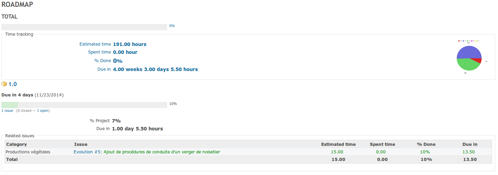

Redmine Plugin: Advanced Roadmap v2
===========================

This plugin is a fork of Redmine Plugin: [advanced roadmap](https://redmine.ociotec.com/projects/advanced-roadmap)

ScreenShot
==========

Features
========

The Advanced Roadmap v2 plugin for Redmine is a plugin that allows to:

1. Show more information into the Roadmap view:
  *  A total for the roadmap is displayed, so you can easily check the whole project status.
  *  Each version has more info about the completion and due times, being these pourcentage values calculated not with the default count of issues, but with the issues duration and completion pourcentages.
  *  The issues of the versions are shown as a table instead as a list, with more information about the time (completed and due) with real status calculated based on the duration, the current completion pourcentage and the consequent estimation of the due time. These issues are printed with color (red: the task is over due, orange: over due but not so bad as red, black: normal, green: the issue is been solved faster than the estimation).

2. You can define milestones for a project, and attach versions to the milestones (from this or other projects):
  * Milestones are edited on the project Settings tab (create, edit (associate versions to them) and delete).
  * Milestone information is shown into the Roadmap view, above the Version list, into a Milestone list. When a milestone view is clicked a view similar to Roadmap is shown, but instead of showing the project versions list, a list of the milestone versions list is shown.

Installation
============

Steps:

1.  Download last version and cd to Redmine root folder 
2.  Create destination directory `mkdir plugins/advanced_roadmap`
3.  Uncompress in this folder `tar xvzf /path/to/advanced_roadmap_vx.y.z.tar.gz -C plugins/advanced_roadmap`
4.  Into the Redmine root folder migrate plugins: `rake redmine:plugins:migrate RAILS_ENV=production`
5.  Option: Install dependency required for pretty graph: `apt-get install ruby-rmagick`
6.  Restart your Redmine.

